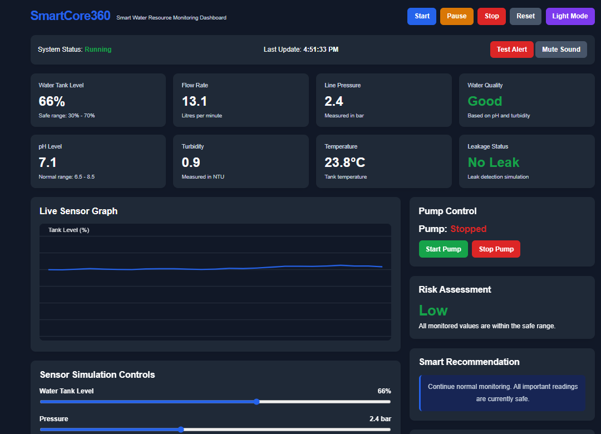

# SmartCore360

### Smart Monitoring & Alert Dashboard

SmartCore360 is an interactive web-based monitoring dashboard designed to demonstrate how real-world sensor data can be monitored, visualized and used to identify abnormal conditions.

## 🚀 Live Demo

https://sharvaaa-bit.github.io/SmartCore360/

## 💡 What It Does

SmartCore360 simulates a smart monitoring environment where users can:

* Monitor simulated sensor values
* View sensor data through interactive gauges
* Visualize changing values using charts
* Start, pause and stop monitoring
* Detect abnormal low/high conditions
* Simulate leakage-related alerts
* Receive visual warning notifications

## 🛠️ Technologies

* HTML5
* CSS3
* JavaScript
* GitHub Pages

## 🎯 Project Goal

The goal of SmartCore360 is to demonstrate a reusable monitoring and alert system that can be adapted to different real-world engineering applications such as water management, smart agriculture, industrial monitoring and infrastructure monitoring.

## 📂 Project Structure

```text
SmartCore360/
├── index.html
├── style.css
├── script.js
└── README.md
```
## 📸 Dashboard Preview



## 👨‍💻 Author

**Sharvanabhuvan AP**

B.Tech Computer Science & Engineering Student
Sri Manakula Vinayagar Engineering College (SMVEC), Puducherry

